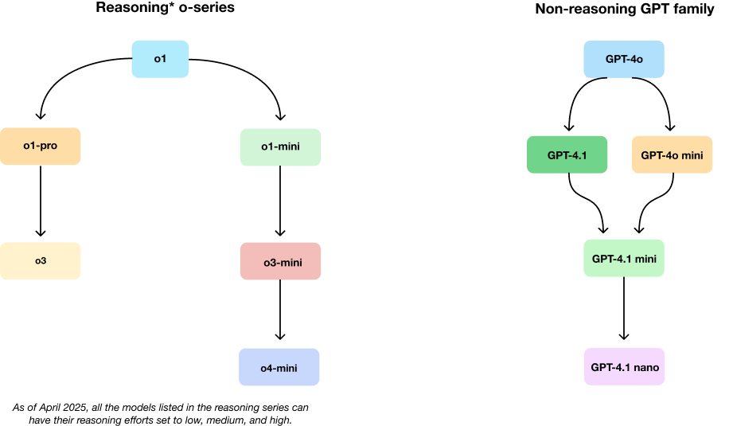

# Model Guide

## Model‑Intro Matrix

| Model      | Core strength                | Ideal first reach‑for           | Watch‑outs                                 | Escalate / Downgrade path         |
|------------|-----------------------------|----------------------------------|--------------------------------------------|-----------------------------------|
| GPT‑4o     | Real‑time voice / vision chat| Live multimodal agents           | Slightly below 4.1 on text SOTA (state-of-the-art) | Need deep reasoning → o4‑mini     |
| GPT‑4.1    | 1 M‑token text accuracy king | Long‑doc analytics, code review  | Cannot natively reason; higher cost than minis | Tight budget → 4.1‑mini / nano    |
| o3         | Deep tool‑using agent        | High‑stakes, multi‑step reasoning| Latency & price                            | Cost/latency → o4‑mini            |
| o4‑mini    | Cheap, fast reasoning        | High‑volume "good‑enough" logic  | Depth ceiling vs o3                        | Accuracy critical → o3            |

(Full price and utility table → Section 6.1)

## Model Evolution at a Glance

OpenAI's model lineup has evolved to address specialized needs across different dimensions. These diagrams showcase the current model families and their relationships.

### Fundamental Differences: "o-series" vs "GPT" Models

OpenAI offers two distinct model families, each with unique strengths:

- **GPT Models (4o, 4.1):** Optimized for general-purpose tasks with excellent instruction following. GPT-4.1 excels with long contexts (1M tokens) while GPT-4o has variants for realtime speech, text-to-speech, and speech-to-text. GPT-4.1 also comes in a mini, and nano variant, while GPT-4o has a mini variant. These variants are cheaper and faster than their full-size counterparts.

- **o-series Models (o3, o4-mini):** Specialized for deep reasoning and step-by-step problem solving. These models excel at complex, multi-stage tasks requiring logical thinking and tool use. Choose these when accuracy and reasoning depth are paramount. These models also have an optional `reasoning_effort` parameter (that can be set to low, medium, or high), which allows users to control the amount of tokens used for reasoning.

### OpenAI Model Evolution

#### Key Characteristics

- **GPT-4.1 Family:** Optimized for long context processing with 1M token context window.
- **o3:** Specialized for deep multi-step reasoning.
- **o4-mini:** Combines reasoning capabilities with vision at lower cost.

Each model excels in different scenarios, with complementary strengths that can be combined for complex workflows.
