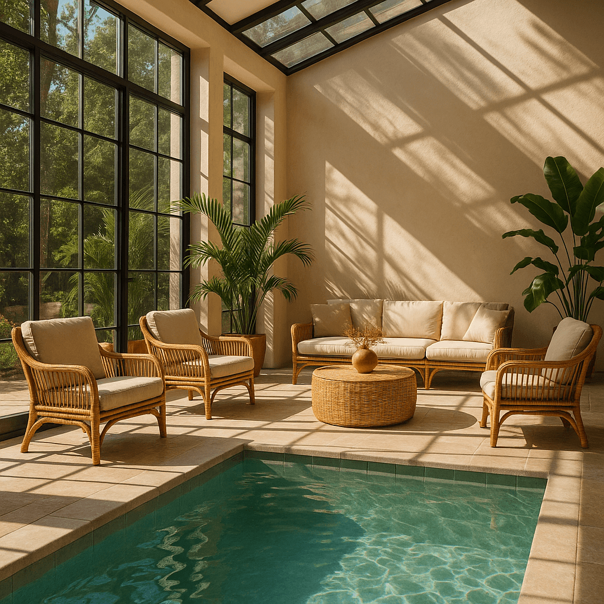

Image generation
================

Learn how to generate or edit images.

## Overview

The OpenAI API lets you generate and edit images from text prompts, using the GPT Image or DALL·E models. You can access image generation capabilities through two APIs:

### Image API

The [Image API](https://platform.openai.com/docs/api-reference/images) provides three endpoints, each with distinct capabilities:

*   **Generations**: [Generate images](#generate-images) from scratch based on a text prompt
*   **Edits**: [Modify existing images](#edit-images) using a new prompt, either partially or entirely
*   **Variations**: [Generate variations](#image-variations) of an existing image (available with DALL·E 2 only)

This API supports `gpt-image-1` as well as `dall-e-2` and `dall-e-3`.

### Responses API

The `Responses API` allows you to generate images as part of conversations or multi-step flows. It supports image generation as a `built-in tool`, and accepts image inputs and outputs within context.

Compared to the Image API, it adds:

*   **Multi-turn editing**: Iteratively make high fidelity edits to images with prompting
*   **Streaming**: Display partial images as the final output is being generated to improve perceived latency
*   **Flexible inputs**: Accept image [File](https://platform.openai.com/docs/api-reference/files) IDs as input images, not just bytes

The image generation tool in responses only supports `gpt-image-1`. For a list of mainline models that support calling this tool, refer to the `supported models` below.

### Choosing the right API

*   If you only need to generate or edit a single image from one prompt, the Image API is your best choice.
*   If you want to build conversational, editable image experiences with GPT Image or display partial images during generation, go with the Responses API.

Both APIs let you [customize output](#customize-image-output) — adjust quality, size, format, compression, and enable transparent backgrounds.

### Model comparison

Our latest and most advanced model for image generation is `gpt-image-1`, a natively multimodal language model.

We recommend this model for its high-quality image generation and ability to use world knowledge in image creation. However, you can also use specialized image generation models—DALL·E 2 and DALL·E 3—with the Image API.

|Model|Endpoints|Use case|
|---|---|---|
|DALL·E 2|Image API: Generations, Edits, Variations|Lower cost, concurrent requests, inpainting (image editing with a mask)|
|DALL·E 3|Image API: Generations only|Higher image quality than DALL·E 2, support for larger resolutions|
|GPT Image|Image API: Generations, Edits – Responses API support coming soon|Superior instruction following, text rendering, detailed editing, real-world knowledge|

This guide focuses on GPT Image, but you can also switch to the docs for [DALL·E 2](/docs/guides/image-generation?image-generation-model=dall-e-2) and [DALL·E 3](/docs/guides/image-generation?image-generation-model=dall-e-3).

To ensure this model is used responsibly, you may need to complete the [API Organization Verification](https://help.openai.com/en/articles/10910291-api-organization-verification) from your [developer console](https://platform.openai.com/settings/organization/general) before using `gpt-image-1`.


## Generate Images

You can use the [image generation endpoint](https://platform.openai.com/docs/api-reference/images/create) to create images based on text prompts, or the `image generation tool` in the Responses API to generate images as part of a conversation.

To learn more about customizing the output (size, quality, format, transparency), refer to the [customize image output](#customize-image-output) section below.

You can set the `n` parameter to generate multiple images at once in a single request (by default, the API returns a single image).

**Responses API**

Generate an image

```python
from openai import OpenAI
import base64

client = OpenAI() 

response = client.responses.create(
    model="gpt-4.1-mini",
    input="Generate an image of gray tabby cat hugging an otter with an orange scarf",
    tools=[{"type": "image_generation"}],
)

# Save the image to a file
image_data = [
    output.result
    for output in response.output
    if output.type == "image_generation_call"
]
    
if image_data:
    image_base64 = image_data[0]
    with open("otter.png", "wb") as f:
        f.write(base64.b64decode(image_base64))
```

**Image API**

Generate an image
```python
from openai import OpenAI
import base64
client = OpenAI()

prompt = """
A children's book drawing of a veterinarian using a stethoscope to 
listen to the heartbeat of a baby otter.
"""

result = client.images.generate(
    model="gpt-image-1",
    prompt=prompt
)

image_base64 = result.data[0].b64_json
image_bytes = base64.b64decode(image_base64)

# Save the image to a file
with open("otter.png", "wb") as f:
    f.write(image_bytes)
```

### Multi-turn image generation

With the Responses API, you can build multi-turn conversations involving image generation either by providing image generation calls outputs within context (you can also just use the image ID), or by using the [`previous_response_id` parameter](/docs/guides/conversation-state?api-mode=responses#openai-apis-for-conversation-state). This makes it easy to iterate on images across multiple turns—refining prompts, applying new instructions, and evolving the visual output as the conversation progresses.

**Using previous response ID**

Multi-turn image generation

```python
from openai import OpenAI
import base64

client = OpenAI()

response = client.responses.create(
    model="gpt-4.1-mini",
    input="Generate an image of gray tabby cat hugging an otter with an orange scarf",
    tools=[{"type": "image_generation"}],
)

image_data = [
    output.result
    for output in response.output
    if output.type == "image_generation_call"
]

if image_data:
    image_base64 = image_data[0]

    with open("cat_and_otter.png", "wb") as f:
        f.write(base64.b64decode(image_base64))

# Follow up

response_fwup = client.responses.create(
    model="gpt-4.1-mini",
    previous_response_id=response.id,
    input="Now make it look realistic",
    tools=[{"type": "image_generation"}],
)

image_data_fwup = [
    output.result
    for output in response_fwup.output
    if output.type == "image_generation_call"
]

if image_data_fwup:
    image_base64 = image_data_fwup[0]
    with open("cat_and_otter_realistic.png", "wb") as f:
        f.write(base64.b64decode(image_base64))
```

**Using image ID**

Multi-turn image generation

```python
import openai
import base64

response = openai.responses.create(
    model="gpt-4.1-mini",
    input="Generate an image of gray tabby cat hugging an otter with an orange scarf",
    tools=[{"type": "image_generation"}],
)

image_generation_calls = [
    output
    for output in response.output
    if output.type == "image_generation_call"
]

image_data = [output.result for output in image_generation_calls]

if image_data:
    image_base64 = image_data[0]

    with open("cat_and_otter.png", "wb") as f:
        f.write(base64.b64decode(image_base64))

# Follow up

response_fwup = openai.responses.create(
    model="gpt-4.1-mini",
    input=[
        {
            "role": "user",
            "content": [{"type": "input_text", "text": "Now make it look realistic"}],
        },
        {
            "type": "image_generation_call",
            "id": image_generation_calls[0].id,
        },
    ],
    tools=[{"type": "image_generation"}],
)

image_data_fwup = [
    output.result
    for output in response_fwup.output
    if output.type == "image_generation_call"
]

if image_data_fwup:
    image_base64 = image_data_fwup[0]
    with open("cat_and_otter_realistic.png", "wb") as f:
        f.write(base64.b64decode(image_base64))
```

#### Result

|"Generate an image of gray tabby cat hugging an otter with an orange scarf"||
|"Now make it look realistic"||

### Streaming

The Responses API also supports streaming image generation. This allows you to stream partial images as they are generated, providing a more interactive experience.

You can adjust the `partial_images` parameter to receive 1-3 partial images.

### Revised prompt

When using the image generation tool in the Responses API, the mainline model (e.g. `gpt-4.1`) will automatically revise your prompt for improved performance.

You can access the revised prompt in the `revised_prompt` field of the image generation call:

```json
{
  "id": "ig_123",
  "type": "image_generation_call",
  "status": "completed",
  "revised_prompt": "A gray tabby cat hugging an otter. The otter is wearing an orange scarf. Both animals are cute and friendly, depicted in a warm, heartwarming style.",
  "result": "..."
}
```

Edit Images
-----------

The [image edits](/docs/api-reference/images/createEdit) endpoint lets you:

*   Edit existing images
*   Generate new images using other images as a reference
*   Edit parts of an image by uploading an image and mask indicating which areas should be replaced (a process known as **inpainting**)

### Create a new image using image references

You can use one or more images as a reference to generate a new image.

In this example, we'll use 4 input images to generate a new image of a gift basket containing the items in the reference images.

[](https://cdn.openai.com/API/docs/images/body-lotion.png)[](https://cdn.openai.com/API/docs/images/soap.png)[](https://cdn.openai.com/API/docs/images/incense-kit.png)[](https://cdn.openai.com/API/docs/images/bath-bomb.png)


Responses API

With the Responses API, you can provide input images in 2 different ways:

*   By providing an image as a Base64-encoded data URL
*   By providing a file ID (created with the `Files API`

We're actively working on supporting fully qualified URLs to image files as input as well.

**Create a File**

Edit an image

```python
from openai import OpenAI
client = OpenAI()

def create_file(file_path):
  with open(file_path, "rb") as file_content:
    result = client.files.create(
        file=file_content,
        purpose="vision",
    )
    return result.id
```

**Create a base64 encoded image**

Edit an image

```python
def encode_image(file_path):
    with open(file_path, "rb") as f:
        base64_image = base64.b64encode(f.read()).decode("utf-8")
    return base64_image
```

**Edit an image**

```python
from openai import OpenAI
import base64

client = OpenAI()

prompt = """Generate a photorealistic image of a gift basket on a white background 
labeled 'Relax & Unwind' with a ribbon and handwriting-like font, 
containing all the items in the reference pictures."""

base64_image1 = encode_image("body-lotion.png")
base64_image2 = encode_image("soap.png")
file_id1 = create_file("body-lotion.png")
file_id2 = create_file("incense-kit.png")

response = client.responses.create(
    model="gpt-4.1",
    input=[
        {
            "role": "user",
            "content": [
                {"type": "input_text", "text": prompt},
                {
                    "type": "input_image",
                    "image_url": f"data:image/jpeg;base64,{base64_image1}",
                },
                {
                    "type": "input_image",
                    "image_url": f"data:image/jpeg;base64,{base64_image2}",
                },
                {
                    "type": "input_image",
                    "file_id": file_id1,
                },
                {
                    "type": "input_image",
                    "file_id": file_id2,
                }
            ],
        }
    ],
    tools=[{"type": "image_generation"}],
)

image_generation_calls = [
    output
    for output in response.output
    if output.type == "image_generation_call"
]

image_data = [output.result for output in image_generation_calls]

if image_data:
    image_base64 = image_data[0]
    with open("gift-basket.png", "wb") as f:
        f.write(base64.b64decode(image_base64))
else:
    print(response.output.content)
```

Image API

**Edit an image**

```python
import base64
from openai import OpenAI
client = OpenAI()

prompt = """
Generate a photorealistic image of a gift basket on a white background 
labeled 'Relax & Unwind' with a ribbon and handwriting-like font, 
containing all the items in the reference pictures.
"""

result = client.images.edit(
    model="gpt-image-1",
    image=[
        open("body-lotion.png", "rb"),
        open("bath-bomb.png", "rb"),
        open("incense-kit.png", "rb"),
        open("soap.png", "rb"),
    ],
    prompt=prompt
)

image_base64 = result.data[0].b64_json
image_bytes = base64.b64decode(image_base64)

# Save the image to a file
with open("gift-basket.png", "wb") as f:
    f.write(image_bytes)
```

### Edit an image using a mask (inpainting)

You can provide a mask to indicate which part of the image should be edited.

When using a mask with GPT Image, additional instructions are sent to the model to help guide the editing process accordingly.

Unlike with DALL·E 2, masking with GPT Image is entirely prompt-based. This means the model uses the mask as guidance, but may not follow its exact shape with complete precision.

If you provide multiple input images, the mask will be applied to the first image.

Responses API

**Edit an image with a mask**

```python
from openai import OpenAI
client = OpenAI()

fileId = create_file("sunlit_lounge.png")
maskId = create_file("mask.png")

response = client.responses.create(
    model="gpt-4o",
    input=[
        {
            "role": "user",
            "content": [
                {
                    "type": "input_text",
                    "text": "generate an image of the same sunlit indoor lounge area with a pool but the pool should contain a flamingo",
                },
                {
                    "type": "input_image",
                    "file_id": fileId,
                }
            ],
        },
    ],
    tools=[
        {
            "type": "image_generation",
            "quality": "high",
            "input_image_mask": {
                "file_id": maskId,
            },
        },
    ],
)

image_data = [
    output.result
    for output in response.output
    if output.type == "image_generation_call"
]

if image_data:
    image_base64 = image_data[0]
    with open("lounge.png", "wb") as f:
        f.write(base64.b64decode(image_base64))
```

Image API

**Edit an image with a mask**

```python
from openai import OpenAI
client = OpenAI()

result = client.images.edit(
    model="gpt-image-1",
    image=open("sunlit_lounge.png", "rb"),
    mask=open("mask.png", "rb"),
    prompt="A sunlit indoor lounge area with a pool containing a flamingo"
)

image_base64 = result.data[0].b64_json
image_bytes = base64.b64decode(image_base64)

# Save the image to a file
with open("composition.png", "wb") as f:
    f.write(image_bytes)
```

|Image|Mask|Output|
|---|---|---|
||||

Prompt: a sunlit indoor lounge area with a pool containing a flamingo

#### Mask requirements

The image to edit and mask must be of the same format and size (less than 50MB in size).

The mask image must also contain an alpha channel. If you're using an image editing tool to create the mask, make sure to save the mask with an alpha channel.

Add an alpha channel to a black and white mask

You can modify a black and white image programmatically to add an alpha channel.

Add an alpha channel to a black and white mask

```python
from PIL import Image
from io import BytesIO

# 1. Load your black & white mask as a grayscale image
mask = Image.open(img_path_mask).convert("L")

# 2. Convert it to RGBA so it has space for an alpha channel
mask_rgba = mask.convert("RGBA")

# 3. Then use the mask itself to fill that alpha channel
mask_rgba.putalpha(mask)

# 4. Convert the mask into bytes
buf = BytesIO()
mask_rgba.save(buf, format="PNG")
mask_bytes = buf.getvalue()

# 5. Save the resulting file
img_path_mask_alpha = "mask_alpha.png"
with open(img_path_mask_alpha, "wb") as f:
    f.write(mask_bytes)
```

## Customize Image Output

You can configure the following output options:

*   **Size**: Image dimensions (e.g., `1024x1024`, `1024x1536`)
*   **Quality**: Rendering quality (e.g. `low`, `medium`, `high`)
*   **Format**: File output format
*   **Compression**: Compression level (0-100%) for JPEG and WebP formats
*   **Background**: Transparent or opaque

`size`, `quality`, and `background` support the `auto` option, where the model will automatically select the best option based on the prompt.

### Size and quality options

Square images with standard quality are the fastest to generate. The default size is 1024x1024 pixels.

| Available sizes | 1024x1024 (square)<br>1536x1024 (landscape)<br>1024x1536 (portrait)<br>auto (default) |
| Quality options | low<br>medium<br>high<br>auto (default) |

### Output format

The Image API returns base64-encoded image data. The default format is `png`, but you can also request `jpeg` or `webp`.

If using `jpeg` or `webp`, you can also specify the `output_compression` parameter to control the compression level (0-100%). For example, `output_compression=50` will compress the image by 50%.

> Using `jpeg` is faster than `png`, so you should prioritize this format if latency is a concern.

### Transparency

The `gpt-image-1` model supports transparent backgrounds. To enable transparency, set the `background` parameter to `transparent`.

It is only supported with the `png` and `webp` output formats.

Transparency works best when setting the quality to `medium` or `high`.

Responses API

**Generate an image with a transparent background**

```python
import openai
import base64

response = openai.responses.create(
    model="gpt-4.1-mini",
    input="Draw a 2D pixel art style sprite sheet of a tabby gray cat",
    tools=[
        {
            "type": "image_generation",
            "background": "transparent",
            "quality": "high",
        }
    ],
)

image_data = [
    output.result
    for output in response.output
    if output.type == "image_generation_call"
]

if image_data:
    image_base64 = image_data[0]

    with open("sprite.png", "wb") as f:
        f.write(base64.b64decode(image_base64))
```

Image API

Generate an image with a transparent background
```python
from openai import OpenAI
import base64
client = OpenAI()

result = client.images.generate(
    model="gpt-image-1",
    prompt="Draw a 2D pixel art style sprite sheet of a tabby gray cat",
    size="1024x1024",
    background="transparent",
    quality="high",
)

image_base64 = result.json()["data"][0]["b64_json"]
image_bytes = base64.b64decode(image_base64)

# Save the image to a file
with open("sprite.png", "wb") as f:
    f.write(image_bytes)
```

## Limitations

The GPT Image 1 model is a powerful and versatile image generation model, but it still has some limitations to be aware of:

*   **Latency:** Complex prompts may take up to 2 minutes to process.
*   **Text Rendering:** Although significantly improved over the DALL·E series, the model can still struggle with precise text placement and clarity.
*   **Consistency:** While capable of producing consistent imagery, the model may occasionally struggle to maintain visual consistency for recurring characters or brand elements across multiple generations.
*   **Composition Control:** Despite improved instruction following, the model may have difficulty placing elements precisely in structured or layout-sensitive compositions.

### Content Moderation

All prompts and generated images are filtered in accordance with our [content policy](https://labs.openai.com/policies/content-policy).

For image generation using `gpt-image-1`, you can control moderation strictness with the `moderation` parameter. This parameter supports two values:

*   `auto` (default): Standard filtering that seeks to limit creating certain categories of potentially age-inappropriate content.
*   `low`: Less restrictive filtering.

### Supported models

When using image generation in the Responses API, the models that support calling this tool are:

*   `gpt-4o`
*   `gpt-4o-mini`
*   `gpt-4.1`
*   `gpt-4.1-mini`
*   `gpt-4.1-nano`
*   `o3`

## Cost and latency

This model generates images by first producing specialized image tokens. Both latency and eventual cost are proportional to the number of tokens required to render an image—larger image sizes and higher quality settings result in more tokens.

The number of tokens generated depends on image dimensions and quality:

|Quality|Square (1024×1024)|Portrait (1024×1536)|Landscape (1536×1024)|
|---|---|---|---|
|Low|272 tokens|408 tokens|400 tokens|
|Medium|1056 tokens|1584 tokens|1568 tokens|
|High|4160 tokens|6240 tokens|6208 tokens|

Note that you will also need to account for `input tokens`: text tokens for the prompt and image tokens for the input images if editing images.

So the final cost is the sum of:

*   input text tokens
*   input image tokens if using the edits endpoint
*   image output tokens
