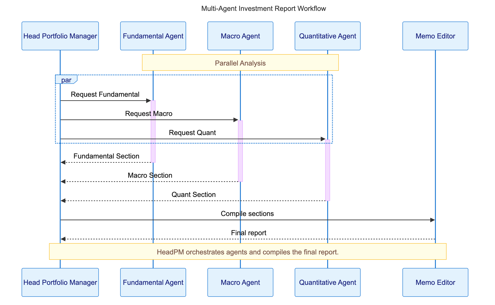
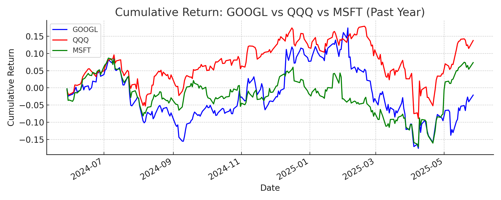
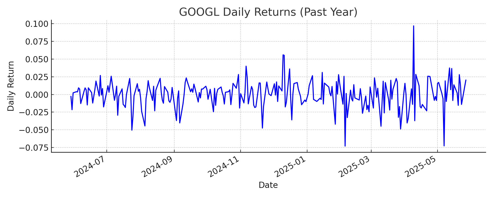
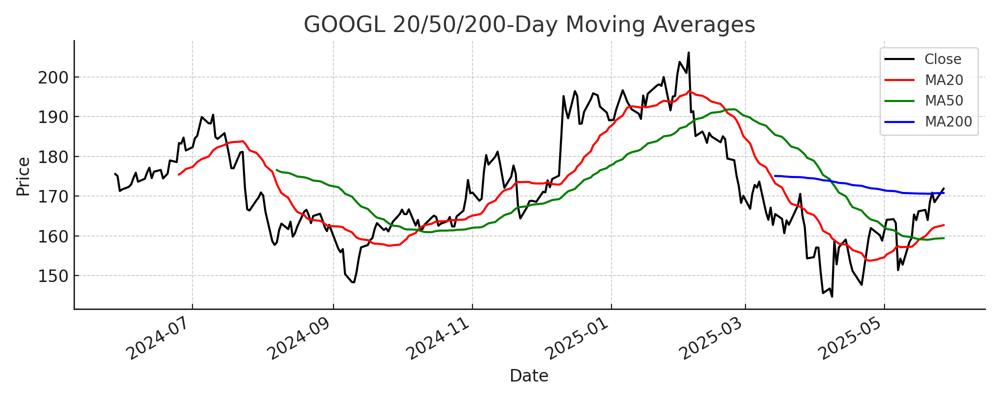
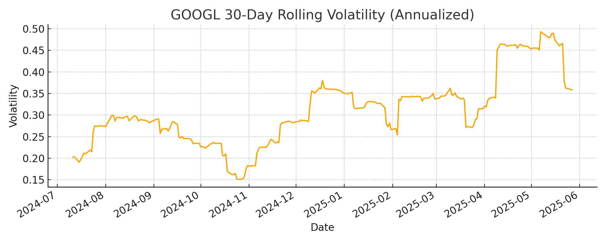
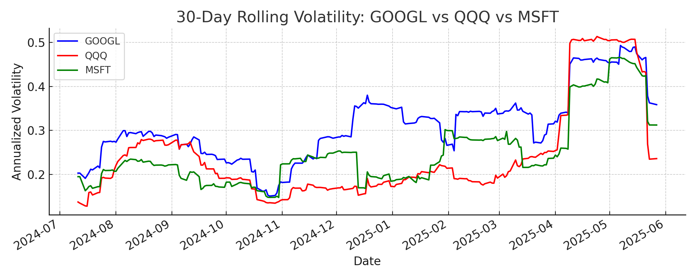
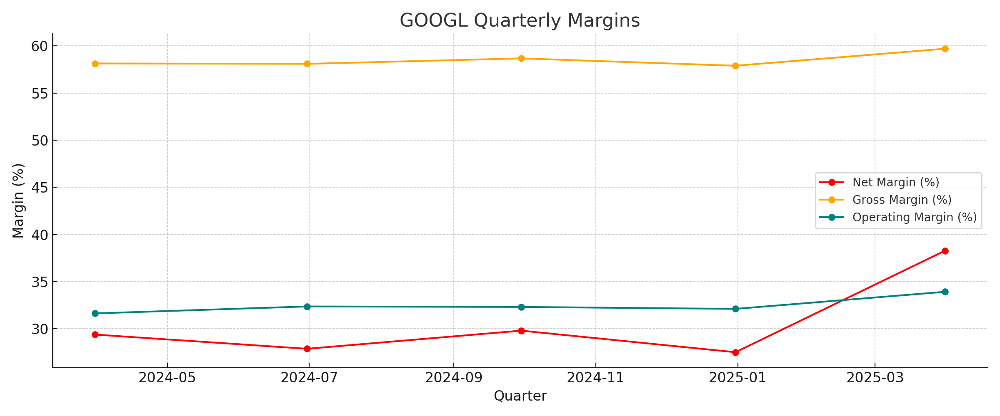
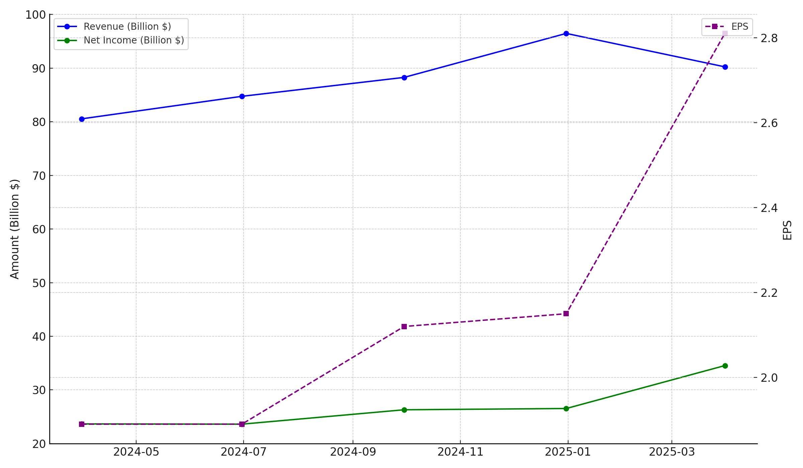
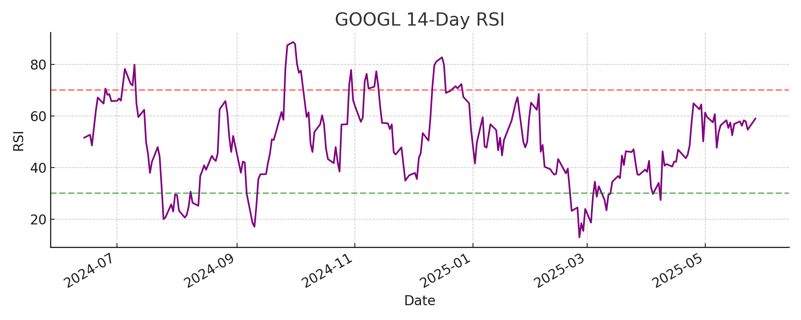
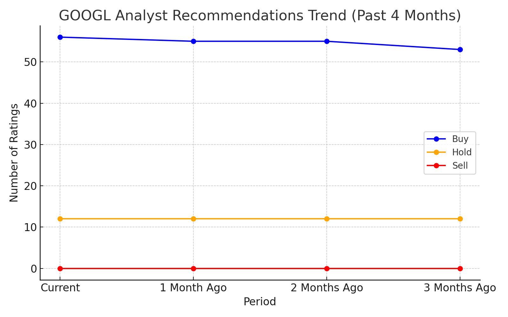

# Use Case: Financial Portfolio Analysis

## Introduction

This guide is for readers already familiar with OpenAI models and LLM agents, and want to see how to orchestrate a team of agents for a real-world, complex task.

### What You'll Learn

In this notebook, you'll learn how to use the OpenAI Agents SDK to design and implement a complex multi-agent collaboration system. Specifically, you'll see how to:

- Build a workflow where multiple specialist agents (Macro, Fundamental, Quantitative) collaborate under a Portfolio Manager agent to solve a challenging investment research problem.
- Use the "agents as a tool" approach, where a central agent orchestrates and calls other agents as tools for specific subtasks.
- Leverage all major tool types supported by the SDK (custom Python functions, managed tools like Code Interpreter and WebSearch, and external MCP servers) in a single, integrated workflow.
- Apply best practices for modularity, parallelism, and observability in agentic patterns.

### Why this matters

The "agents as a tool" pattern is a powerful way to build transparent, auditable, and scalable multi-agent collaboration. This example demonstrates how to combine deep specialization, parallel execution, and robust orchestration using the OpenAI Agents SDK.

By the end of this guide, you'll have a clear blueprint for building your own multi-agent workflows for research, analysis, or any complex task that benefits from expert collaboration.

---

## What is Multi-Agent Collaboration?

Multi-agent collaboration means multiple autonomous agents (LLM "nodes") coordinate to achieve an overarching goal that would be difficult for a single agent to handle. Instead of one monolithic prompt, each agent handles a specific subtask or expertise area, and an orchestration layer connects these agent "nodes" into a coherent workflow. This approach is useful for complex systems – for example, a financial analysis might be broken into macro-economic analysis, fundamental company analysis, and quantitative signal analysis, each handled by a different agent specialist. The agents share information and their results are combined to produce a final outcome.

---

## Collaboration Patterns: Handoff vs. Agent-as-Tool

The OpenAI Agents SDK supports multiple patterns for agents to work together:

- **Handoff Collaboration:** One agent can handoff control to another agent mid-problem. In a handoff architecture, each agent knows about the others and can decide when to defer to a more appropriate agent. This is flexible for open-ended or conversational workflows, but can make it harder to maintain a global view of the task. Read more in the SDK docs.
- **Agent as a Tool:** In this approach, one agent (often a central planner or manager) calls other agents as if they were tools. Sub-agents don't take over the conversation; instead, the main agent invokes them for specific subtasks and incorporates their results. This model keeps a single thread of control (the main agent orchestrates everything) and tends to simplify coordination. This repo uses the agent-as-tool model: the Portfolio Manager agent remains in charge, using the other specialist agents as tools when it needs their expertise. This choice keeps the overall reasoning transparent and allows parallel execution of sub-tasks, which is ideal for complex analyses.

For more on these collaboration patterns, see the OpenAI Agents SDK documentation.

---

## Architecture Overview

Our system follows a hub-and-spoke design. The Portfolio Manager agent is the hub (central coordinator), and the specialist agents are the spokes. The user's query (e.g. "How would a planned interest rate reduction affect my GOOGL holdings?") goes first to the Portfolio Manager. The Portfolio Manager agent is prompted to break down the problem and delegate to the appropriate specialist agents. It treats each specialist as a callable tool, invoking them for their portion of the analysis. All three report back to the Portfolio Manager, which then synthesizes a final answer for the user.



---

## Supported Tool Types

A key advantage of the Agents SDK is the flexibility in defining tools that agents can use. Tools can range from simple Python functions to external services. In this project, we use:

- **MCP (Model Context Protocol) Server:** Used to connect agents to external tools and data sources in a standardized way. This project uses a local MCP server for Yahoo Finance data (see `mcp/yahoo_finance_server.py`). Learn more: OpenAI MCP docs | MCP Spec
- **OpenAI Managed Tools:** Managed tools are built-in, hosted tools provided by OpenAI that require no custom implementation. They offer powerful capabilities out of the box, such as Code Interpreter (for quantitative/statistical analysis) and WebSearch (for up-to-date news and data).
- **Custom Tools:** Custom tools are any Python functions you define and register as tools for your agent. The Agents SDK makes this easy: just decorate your function, and the SDK will automatically extract its name, docstring, and input schema. This is ideal for domain-specific logic, data access, or workflow extensions.

Want to add more tools? The SDK supports a wide range of tool types, including web search, file search, code execution, and more. See the full list of supported tools in the SDK documentation.

---

## Setup

Install required dependencies:

```bash
!pip install -r requirements.txt
```

Before running the workflow, set your environment variables:

- `OPENAI_API_KEY` (for OpenAI access)
- `FRED_API_KEY` (for FRED economic data, see FRED API key instructions)

```python
import os

missing = []
if not os.environ.get('OPENAI_API_KEY'):
    missing.append('OPENAI_API_KEY')
if not os.environ.get('FRED_API_KEY'):
    missing.append('FRED_API_KEY')

if missing:
    print(f"Missing environment variable(s): {', '.join(missing)}. Please set them before running the workflow.")
else:
    print("All required API keys are set.")
```

---

## Running the Workflow

Edit the question to whatever you'd like, but keep the date field to improve accuracy!

> **Disclaimer:** This example is for educational purposes only. Consult a qualified financial professional before making any investment decisions.

The workflow is kicked off by sending a user request to the Head Portfolio Manager (PM) agent. The PM agent orchestrates the entire process, delegating to specialist agents and tools as needed. You can monitor the workflow in real time using OpenAI Traces, which provide detailed visibility into every agent and tool call.

**Note:** Depending on the complexity of the task, this request can take up to 10 minutes.

```python
import datetime
import json
import os
from pathlib import Path
from contextlib import AsyncExitStack
from agents import Runner, add_trace_processor, trace
from agents.tracing.processors import BatchTraceProcessor
from utils import FileSpanExporter, output_file
from investment_agents.config import build_investment_agents
import asyncio

add_trace_processor(BatchTraceProcessor(FileSpanExporter()))

async def run_workflow():
    if "OPENAI_API_KEY" not in os.environ:
        raise EnvironmentError("OPENAI_API_KEY not set — set it as an environment variable before running.")

    today_str = datetime.date.today().strftime("%B %d, %Y")
    question = (
        f"Today is {today_str}. "
        "How would the planned interest rate reduction effect my holdings in GOOGL if they were to happen?"
        "Considering all the factors effecting its price right now (Macro, Technical, Fundamental, etc.), what is a realistic price target by the end of the year?"
    )
    bundle = build_investment_agents()

    async with AsyncExitStack() as stack:
        for agent in [getattr(bundle, "fundamental", None), getattr(bundle, "quant", None)]:
            if agent is None:
                continue
            for server in getattr(agent, "mcp_servers", []):
                await server.connect()
                await stack.enter_async_context(server)

        print("Running multi-agent workflow with tracing enabled...\n")
        with trace(
            "Investment Research Workflow",
            metadata={"question": question[:512]}
        ) as workflow_trace:
            print(
                f"\n🔗 View the trace in the OpenAI console: "
                f"https://platform.openai.com/traces/trace?trace_id={workflow_trace.trace_id}\n"
            )

            response = None
            try:
                response = await asyncio.wait_for(
                    Runner.run(bundle.head_pm, question, max_turns=40),
                    timeout=1200
                )
            except asyncio.TimeoutError:
                print("\n❌ Workflow timed out after 20 minutes.")

            report_path = None
            try:
                if hasattr(response, 'final_output'):
                    output = response.final_output
                    if isinstance(output, str):
                        data = json.loads(output)
                        if isinstance(data, dict) and 'file' in data:
                            report_path = output_file(data['file'])
            except Exception as e:
                print(f"Could not parse investment report path: {e}")

            print(f"Workflow Completed Response from Agent: {response.final_output if hasattr(response, 'final_output') else response}, investment report created: {report_path if report_path else '[unknown]'}")

# In a Jupyter notebook cell, run:
await run_workflow()
```

---

## Breaking Down the Head Portfolio Manager Agent

The Head Portfolio Manager (PM) agent is the orchestrator of the entire workflow. It coordinates a set of four specialist agents, each focused on a different area of expertise. This design is intentional: overloading a single agent with every possible responsibility leads to shallow, generic outputs and makes it hard to maintain or improve your system over time.

### Why This Design?

By breaking the problem into specialized agents—each with a clear role—you get:

- **Deeper, higher-quality research:** Each agent can focus on its domain, using the right tools and prompts for the job. The PM agent brings these perspectives together for a more nuanced, robust answer.
- **Modularity and clarity:** You can update, test, or improve one agent without affecting the others. This makes your system easier to maintain and extend as your needs evolve.
- **Faster results through parallelism:** Independent agents can work at the same time, dramatically reducing the time to complete complex, multi-part analyses.
- **Consistency and auditability:** A structured, prompt-driven workflow ensures every run follows best practices, is easy to debug, and produces outputs you can trust and review.

This approach is ideal for any application where you want depth, specialization, and reliability—whether you're building a research assistant, a decision support tool, or any system that benefits from expert collaboration and orchestration.

---

### How We Implement This in Practice

Each specialist agent (Fundamental, Macro, Quantitative) is wrapped as a callable tool using the SDK's `function_tool` decorator, with custom names and descriptions. This makes the PM agent's toolset explicit and LLM-friendly.

The Head PM agent uses the `run_all_specialists_parallel` tool to invoke all three specialists concurrently, leveraging `parallel_tool_calls=True` for maximum speed and efficiency.

The agent's prompt is loaded from a markdown file (`pm_base.md`), encoding not just the firm's philosophy but also detailed tool usage rules and a step-by-step workflow. This ensures every run is consistent, auditable, and aligned with best practices.

After gathering and reviewing the specialist outputs, the PM agent uses a dedicated memo editor tool to assemble, format, and finalize the investment report. This separation of concerns keeps the workflow modular and easy to extend.

The system is designed for extensibility: you can add new specialist agents, swap out tools, or update prompts without breaking the overall orchestration logic. All tool calls, agent decisions, and outputs are captured in OpenAI Traces for full transparency and debugging.

---

### Head Portfolio Manager Agent: Code

```python
from agents import Agent, ModelSettings, function_tool
from utils import load_prompt, DISCLAIMER

def build_head_pm_agent(fundamental, macro, quant, memo_edit_tool):
    def make_agent_tool(agent, name, description):
        @function_tool(name_override=name, description_override=description)
        async def agent_tool(input):
            return await specialist_analysis_func(agent, input)
        return agent_tool
    fundamental_tool = make_agent_tool(fundamental, "fundamental_analysis", "Generate the Fundamental Analysis section.")
    macro_tool = make_agent_tool(macro, "macro_analysis", "Generate the Macro Environment section.")
    quant_tool = make_agent_tool(quant, "quantitative_analysis", "Generate the Quantitative Analysis section.")

    @function_tool(name_override="run_all_specialists_parallel", description_override="Run all three specialist analyses (fundamental, macro, quant) in parallel and return their results as a dict.")
    async def run_all_specialists_tool(fundamental_input, macro_input, quant_input):
        return await run_all_specialists_parallel(
            fundamental, macro, quant,
            fundamental_input, macro_input, quant_input
        )

    return Agent(
        name="Head Portfolio Manager Agent",
        instructions=(load_prompt("pm_base.md") + DISCLAIMER),
        model="gpt-4.1",
        tools=[fundamental_tool, macro_tool, quant_tool, memo_edit_tool, run_all_specialists_tool],
        model_settings=ModelSettings(parallel_tool_calls=True, tool_choice="auto", temperature=0)
    )
```

---

## The Head PM System Prompt: Enforcing Best Practices

The PM agent's system prompt (see `prompts/pm_base.md`) is the heart of the workflow. It encodes:

- The firm's philosophy (originality, risk awareness, challenging consensus)
- Clear tool usage rules (when to use parallel tools, how to structure inputs)
- A robust, multi-step workflow (determine task type, provide guidance, review outputs, assemble memo, handle missing data)

This prompt ensures that every run is:

- **Consistent:** The same high standards and process are followed every time.
- **Auditable:** Each step, tool call, and decision is visible in the trace.
- **High-Quality:** Outputs are original, risk-aware, and rigorously reviewed.

```python
from pathlib import Path
from IPython.display import Markdown, display

pm_prompt_path = Path("prompts/pm_base.md")
if pm_prompt_path.exists():
    with pm_prompt_path.open("r", encoding="utf-8") as f:
        content = f.read()
    display(Markdown(content))
else:
    print("System prompt not found at prompts/pm_base.md")
```

---

## Example Output

Here's an example of an investment report generated through the workflow. Your output will be written to the outputs folder in the directory.

<details>
<summary>Click to expand Investment Memo</summary>

*Investment Memo: Alphabet Inc. (GOOGL) – Impact of Planned Interest Rate Reduction (May 2025)*

<!-- (Insert the full memo text here as in your original content) -->

</details>

---

## Example Visualizations

<!-- Insert the following images in the appropriate order for your analysis. -->











---

## Best Practices When Building Agents

The most effective agentic systems combine modular agent design, clear tool definitions, parallel execution, and structured prompts. This approach—central to the OpenAI Agents SDK—makes your workflows robust, scalable, and easy to debug or extend.

**Key features of the OpenAI Agents SDK that enable these best practices:**

- Agent loop: Handles tool calls, LLM reasoning, and workflow control automatically.
- Python-first orchestration: Use familiar Python patterns to chain, compose, and orchestrate agents.
- Handoffs: Delegate tasks between agents for specialization and modularity.
- Guardrails: Validate inputs/outputs and break early on errors for reliability.
- Function tools: Register any Python function as a tool, with automatic schema and validation.
- Tracing: Visualize, debug, and monitor every step of your workflow for full transparency.

A combination of well-designed tools, thoughtful orchestration, and careful model selection is crucial for building effective agent systems. In this example, we use the GPT-4.1 family of models for their strong analytical and tool-use capabilities (see the GPT-4.1 Prompting Guide). For deeper architectural best practices, see the included A Practical Guide to Building Agents (PDF). By bringing these elements together, you get a system that is robust, scalable, and easy to debug or extend.