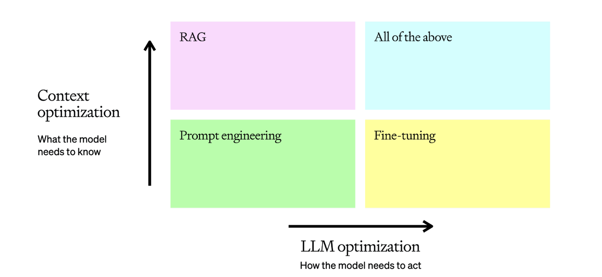

# Day 4: Evaluation & Optimization

## 📝 Overview

Welcome to Day 4! With our agent built and production-ready, it's time to focus on making it better. Today is all about evaluation and optimization. We'll learn how to measure our agent's performance, design effective evaluations, and use various techniques to improve its accuracy and reliability.

## 🎯 Day 4 Goals

-   Understand the importance of evaluations (evals) in LLM development.
-   Learn how to create and run evals using the OpenAI Evals API.
-   Design effective evaluation strategies for different types of agent architectures.
-   Explore techniques for optimizing LLM accuracy, including prompt engineering, RAG, and fine-tuning.

---

## 📖 Key Concepts

### 1. Evaluating Model Performance

Evals are structured tests to measure a model's performance against your criteria. The process involves:
1.  **Describing the task** as an eval.
2.  **Running the eval** with test data.
3.  **Analyzing the results** and iterating.

**Code Example: Creating an Eval**

```python
from openai import OpenAI
client = OpenAI()

eval_obj = client.evals.create(
    name="IT Ticket Categorization",
    data_source_config={
        "type": "custom",
        "item_schema": {
            "type": "object",
            "properties": {
                "ticket_text": {"type": "string"},
                "correct_label": {"type": "string"},
            },
            "required": ["ticket_text", "correct_label"],
        },
        "include_sample_schema": True,
    },
    testing_criteria=[
        {
            "type": "string_check",
            "name": "Match output to human label",
            "input": "{{ sample.output_text }}",
            "operation": "eq",
            "reference": "{{ item.correct_label }}",
        }
    ],
)
```

### 2. Evaluation Design Best Practices

Designing effective evals is crucial for understanding and improving your agent.

**Key Principles:**
-   **Define a clear objective:** What does success look like?
-   **Collect a diverse dataset:** Include typical cases, edge cases, and adversarial examples.
-   **Define your metrics:** How will you measure success?
-   **Automate where possible:** Use metric-based evals and LLM-as-a-judge to scale your evaluation process.
-   **Continuously evaluate:** Make evaluation a part of your development lifecycle.

### 3. Optimizing LLM Accuracy

There are several levers you can pull to optimize your LLM's accuracy and consistency.

-   **Prompt Engineering:** The starting point for optimization. Refine your prompts with clear instructions, examples, and context.
-   **Retrieval-Augmented Generation (RAG):** Give your model access to external knowledge to improve contextual accuracy.
-   **Fine-Tuning:** Train the model on your own data to improve its performance on specific tasks and enhance its consistency.

**The Optimization Matrix:**

-   **Context Optimization (RAG):** Use when the model lacks knowledge.
-   **LLM Optimization (Fine-Tuning):** Use when the model is inconsistent or its reasoning is flawed.



---

## 🚀 Activities

### Activity 1: Create Your First Eval

1.  Choose a specific task your agent performs (e.g., classification, summarization).
2.  Define the `data_source_config` and `testing_criteria` for your eval.
3.  Create the eval using the Evals API.

### Activity 2: Run Your Eval

1.  Create a small dataset of test cases in a JSONL file.
2.  Upload the file to OpenAI.
3.  Create an eval run, providing your eval ID, a prompt to test, and your test data file.
4.  Analyze the results in the OpenAI dashboard.

### Activity 3: Optimize Your Agent

1.  Based on the results of your eval, identify areas for improvement.
2.  If the issue is a lack of knowledge, consider implementing a RAG pipeline.
3.  If the issue is inconsistent behavior, try refining your prompt with more examples or consider fine-tuning.
4.  Rerun your eval to measure the impact of your changes.

### Activity 4: Design an Evaluation Strategy

1.  Think about the different components of your agent architecture (e.g., single-turn, workflow, single-agent, multi-agent).
2.  For each component, identify the potential points of failure and design an eval to test for them.
3.  Consider how you would use a combination of metric-based evals, human evals, and LLM-as-a-judge to get a comprehensive view of your agent's performance.

---

## ✅ Day 4 Success Checklist

-   [ ] Created and ran an eval for your agent.
-   [ ] Analyzed the results of your eval and identified areas for improvement.
-   [ ] Applied at least one optimization technique (prompt engineering, RAG, or fine-tuning) to your agent.
-   [ ] Designed a comprehensive evaluation strategy for your agent architecture.
-   [ ] Understood the trade-offs between different optimization methods.
